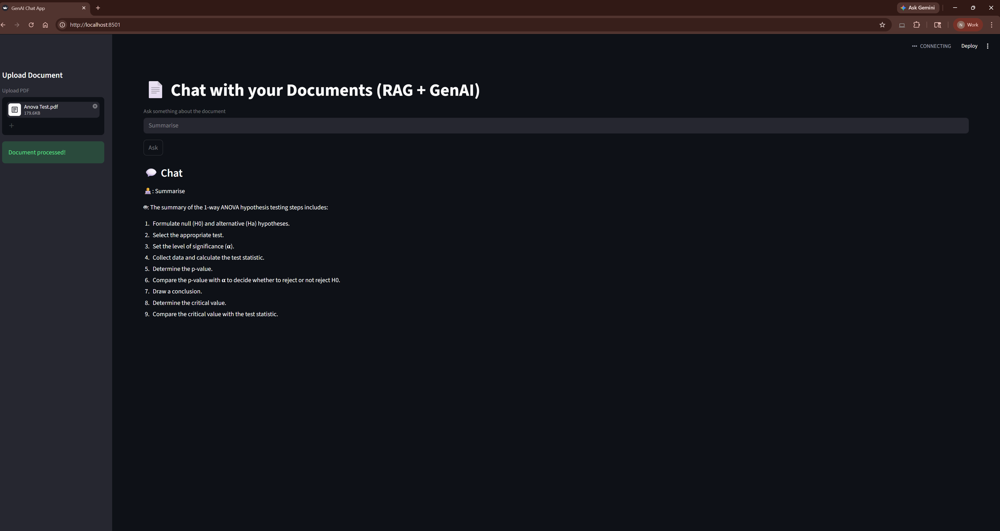

#  GenAI RAG Chat Application (Streamlit)

##  Overview

This project is a **Streamlit-based GenAI application** that enables users to upload PDF documents and ask questions based on their content using a **Retrieval-Augmented Generation (RAG)** pipeline.

The system retrieves relevant document chunks and generates **grounded, context-aware responses** using a Large Language Model (LLM).

---

##  Why This Project

This project demonstrates how modern GenAI systems can be built to:

* Reduce hallucinations in LLM responses
* Enable document-grounded question answering
* Simulate enterprise-grade knowledge retrieval systems
* Combine **LLMs + Vector Databases + Embeddings** effectively

---

##  Features

* Upload PDF documents
* Semantic search using vector embeddings (**FAISS**)
* LLM-powered question answering
* Context-aware responses using RAG
* Chat interface with session memory

---

##  Architecture

```
User Query
   ↓
Embedding Model
   ↓
FAISS Vector Store (Similarity Search)
   ↓
Top-K Relevant Chunks
   ↓
LLM (Context + Prompt)
   ↓
Final Response
```

---

##  Tech Stack

* **Frontend/UI**: Streamlit
* **LLM Integration**: OpenAI / Enterprise LLM Endpoint
* **RAG Framework**: LangChain
* **Vector Store**: FAISS
* **PDF Parsing**: PyMuPDF
* **Environment Management**: python-dotenv

---

##  Demo


```
/assets/demo.png
```

---

##  Local Setup Instructions

### 1. Clone the repository

```bash
git clone <your-repo-url>
cd streamlit-genai-app
```

---

### 2. Create virtual environment

```bash
python -m venv streamlit_env
```

---

### 3. Activate environment

```bash
# Windows
streamlit_env\Scripts\activate

# Mac/Linux
source streamlit_env/bin/activate
```

---

### 4. Install dependencies

```bash
pip install -r requirements.txt
```

---

##  Environment Variables

Create a `.env` file in the root directory:

```env
OPENAI_API_KEY=your_api_key
OPENAI_BASE_URL=your_base_url
```


---

## Run the Application

```bash
streamlit run app.py
```

---

## How to Use

1. Upload a PDF file
2. Enter a question related to the document
3. View:

   * Retrieved context chunks
   * AI-generated answer

---

## Notes

* Ensure the PDF contains **selectable text** (not scanned images)
* For enterprise setups, configure correct `base_url` and model name
* Responses are **grounded in retrieved document context**, reducing hallucination risk

---

# Docker Setup

## Prerequisites

* Windows 10/11 (64-bit)
* WSL2 enabled
* Ubuntu (or any Linux distro in WSL)
* Docker Desktop installed

---

## Step 1: Install Docker

1. Download Docker Desktop:
   https://www.docker.com/products/docker-desktop/

2. Install and launch Docker Desktop

3. Enable **WSL 2 integration** during setup

---

## Step 2: Verify Installation

```bash
docker version
```

Ensure both **Client** and **Server** are visible.

---

## Step 3: Fix Permission Issue (WSL)

```bash
sudo usermod -aG docker $USER
```

Then restart WSL from Windows PowerShell:

```bash
wsl --shutdown
```

Reopen terminal and verify:

```bash
docker version
```

---

## Step 4: Navigate to Project

```bash
cd /mnt/d/streamlit-genai-app
```

---

#  Step 5: Create Dockerfile

Create a file named `Dockerfile` and add:

```dockerfile
FROM python:3.10-slim

WORKDIR /app

COPY . /app

RUN pip install --no-cache-dir -r requirements.txt

EXPOSE 8501

CMD ["streamlit", "run", "app.py", "--server.port=8501", "--server.address=0.0.0.0"]
```

---

#  Step 6: Create requirements.txt

Generate dependencies:

```bash
pip freeze > requirements.txt
```

---

##  Step 7: Build Docker Image

```bash
docker build -t streamlit-genai-app .
```

---

##  Step 8: Run Container

```bash
docker run -p 8501:8501 streamlit-genai-app
```

---

##  Step 9: Access Application

Open in browser:

http://localhost:8501

---

##  Common Issues & Fixes

###  Docker not running

* Start Docker Desktop

###  Permission denied

```bash
newgrp docker
```

###  App not loading

* Check logs in terminal
* Verify `app.py` exists
* Ensure dependencies are installed

---

## Project Structure

```
streamlit-genai-app/
│── app.py
│── requirements.txt
│── Dockerfile
│── README.md
│── utils/
```

---

## Future Enhancements

* Multi-document support
* Source citation UI
* Streaming responses
* Agent-based workflows
* FastAPI backend integration
* Docker Compose (multi-container setup)
* Cloud deployment (Azure / AWS)

---

## Session Context

This project was built as part of a hands-on session on:

**“Building GenAI Applications with Streamlit and RAG Systems”**

---

## License

For educational purposes only.

---

